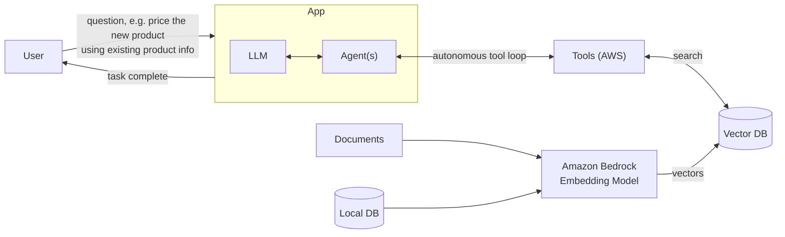
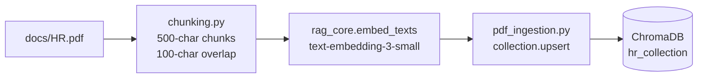
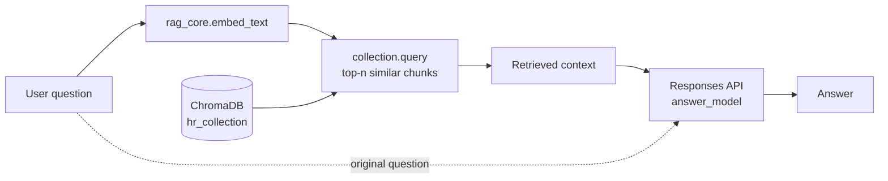
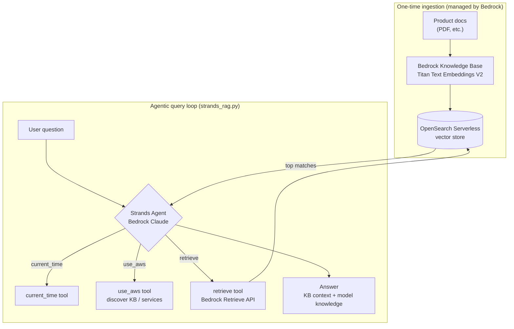

# AgenticRAG

A small retrieval-augmented generation (RAG) example that answers questions from an HR PDF. It uses OpenAI embeddings, ChromaDB for vector storage, and an OpenAI response model for final answers.

## Agentic RAG at a Glance

The general pattern this project draws on: **agent** contributes an autonomous loop that calls tools until a task is done, and **RAG** contributes company knowledge stored as vectors. Combined, the agent can reach into a vector store (populated from your own documents) whenever the base model lacks the answer.



## How It Works

1. `chunking.py` extracts the PDF text and splits it into 500-character chunks with 100-character overlap, attaching an ID and metadata to each.
2. `rag_core.py` holds the shared configuration, OpenAI/Chroma clients, and embedding helpers used by both scripts, so indexing and querying always use the same model and dimensions.
3. `pdf_ingestion.py` embeds the chunks with `text-embedding-3-small` and upserts them into the persistent ChromaDB collection `hr_collection` under `./chroma_db`.
4. `pdf_retriever.py` embeds a user question, retrieves the most relevant chunks, and sends them as context to an OpenAI response model.

### Ingestion pipeline

Run once (and again whenever the PDF or embedding settings change).



### Retrieval pipeline

Runs on every question.



## Requirements

- Python 3.10 or newer
- An OpenAI API key
- The project virtual environment in `rag/` (or another Python virtual environment)

Install the dependencies with:

```powershell
pip install -r requirements.txt
```

## Environment Setup

Create a `.env` file in the project root:

```env
OPENAI_API_KEY=your_api_key_here
```

Optional overrides (defaults shown):

```env
EMBEDDING_MODEL=text-embedding-3-small
EMBEDDING_DIMENSIONS=1536
ANSWER_MODEL=gpt-5.6-sol
CHROMA_PATH=./chroma_db
COLLECTION_NAME=hr_collection
```

Do not commit `.env` or expose the API key in source control.

## Usage

Run these commands from the project root.

### 1. Ingest the PDF

Run ingestion first so the ChromaDB collection contains the PDF chunks:

```powershell
python .\pdf_ingestion.py
```

On Windows, you can use the included virtual environment directly:

```powershell
.\rag\Scripts\python.exe .\pdf_ingestion.py
```

### 2. Ask a Question

The question is now a command-line argument (no need to edit the source):

```powershell
python .\pdf_retriever.py "what is the leave policy"
```

With no argument it falls back to the default question. Use `-n` to change how many chunks are retrieved:

```powershell
python .\pdf_retriever.py "how many sick days do I get" -n 5
```

## AWS Version (Bedrock + Strands)

`strands_rag.py` is an AWS-native alternative that swaps the self-managed OpenAI/ChromaDB stack for managed AWS services. A [Bedrock Knowledge Base](https://docs.aws.amazon.com/bedrock/latest/userguide/knowledge-base.html) handles chunking, embedding (Amazon Titan Text Embeddings V2), and storage (OpenSearch Serverless), and a [Strands](https://strandsagents.com/) agent on a Bedrock Claude model runs the *agentic* loop — deciding on its own when to call the `retrieve` tool versus answer from the model's own knowledge.

The difference from the local scripts: there is no separate chunking/ingestion code to run. You upload documents to the Knowledge Base once (console or API) and the agent retrieves against it at query time.

| Concern | Local version | AWS version |
| --- | --- | --- |
| Embeddings | OpenAI `text-embedding-3-small` | Amazon Titan Text Embeddings V2 |
| Vector store | ChromaDB (`./chroma_db`) | Bedrock Knowledge Base → OpenSearch Serverless |
| Chunking + ingestion | `chunking.py` + `pdf_ingestion.py` | Managed by the Knowledge Base (custom data source) |
| Retrieval | `collection.query` | `retrieve` tool (Bedrock Retrieve API) |
| Answer model | OpenAI Responses API | Bedrock Claude (via Strands) |
| Orchestration | Straight-line script | Strands agent (autonomous tool loop) |



### Setup

1. In the Bedrock console, **Create Knowledge Base with vector store**. Pick **Custom** as the data source, **Titan Text Embeddings V2** as the embedding model, and **OpenSearch Serverless** (Quick create) as the vector store.
2. Add your documents directly to the Knowledge Base and let the sync complete.
3. Copy the Knowledge Base ID (10 characters, e.g. `ABCDEFGHIJ`).

Install the AWS extras and set the environment:

```powershell
pip install strands-agents strands-agents-tools
```

```env
AWS_REGION=us-east-2
KNOWLEDGE_BASE_ID=your_kb_id_here
BEDROCK_MODEL_ID=us.anthropic.claude-sonnet-4-20250514-v1:0
```

Credentials come from the standard AWS chain (`aws configure` or an instance profile), and the chosen Claude model must be enabled in Bedrock model access.

### Run

```powershell
python .\strands_rag.py "What do you know about our products? List current and research ones."
```

The agent decides which tools to call and how many times; with a broad system prompt it will use `use_aws` to discover the Knowledge Base before calling `retrieve`. Passing `KNOWLEDGE_BASE_ID` explicitly (as above) skips that discovery step and is faster.

## Project Files

- `rag_core.py`: Shared settings, clients, and embedding helpers.
- `pdf_ingestion.py`: Embeds PDF chunks and upserts them into ChromaDB.
- `pdf_retriever.py`: Retrieves relevant chunks and generates an answer.
- `strands_rag.py`: AWS-native agentic RAG using Strands + a Bedrock Knowledge Base.
- `chunking.py`: Extracts PDF text, creates overlapping chunks, IDs, and metadata.
- `chroma_store.py`: Example of storing manually defined documents and topic metadata.
- `chroma_read.py`: Example of querying a ChromaDB collection with an embedding.
- `vector_similarities.py`: Example of comparing embeddings with cosine similarity.
- `docs/HR.pdf`: Source document for the PDF RAG workflow.
- `chroma_db/`: Persistent local ChromaDB data created at runtime.

## Important Notes

- **Embedding dimensions matter.** `EMBEDDING_DIMENSIONS` defaults to `1536`. Very low values (e.g. 4) collapse the vectors to the point where similarity search returns near-random chunks. Keep indexing and querying on the same model and dimensions.
- **Changing the model or dimensions requires a rebuild.** A Chroma collection's dimension is fixed at first write. If you change either, delete the `chroma_db/` directory and re-ingest, or you'll hit a dimension-mismatch error.
- **Re-running ingestion is safe.** It uses `upsert`, so the same IDs update in place rather than raising duplicate-ID errors.
- Run ingestion before retrieval. If the collection is empty, retrieval has no context to work with.
- The PDF path is relative to the project root, so run the commands from `AgenticRAG`.
- The retriever answers from retrieved context and says it does not know when the context is insufficient.