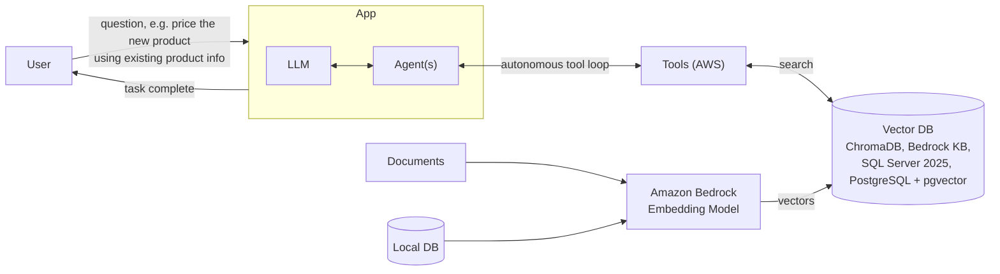
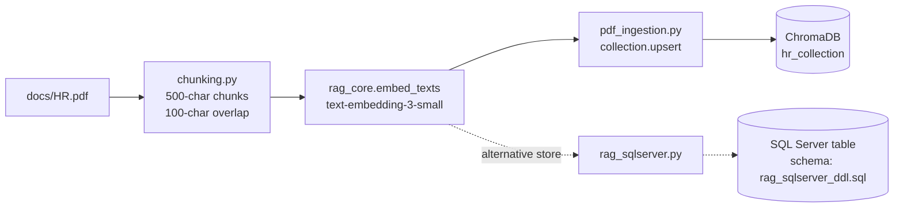
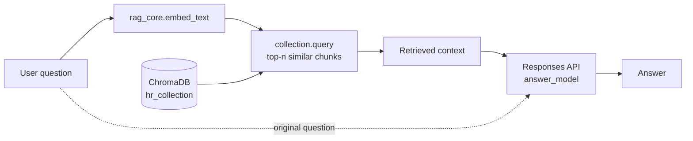
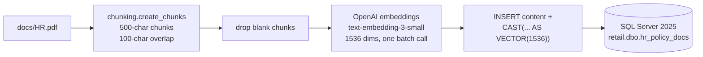
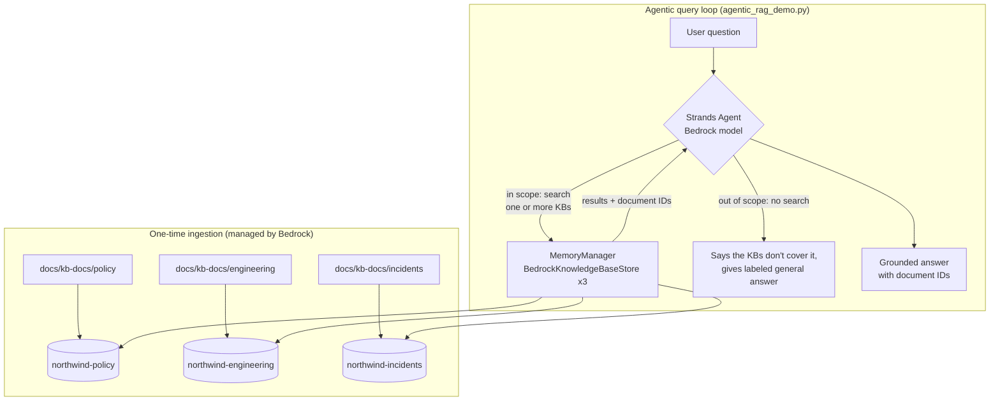
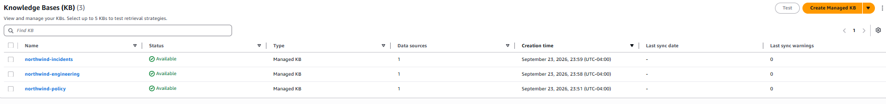

# AgenticRAG

Retrieval-augmented generation (RAG) examples that progress from a simple local pipeline, through a relational vector store, to a multi-knowledge-base agent on AWS:

| Example | What it shows | Stack |
| --- | --- | --- |
| **Local RAG** (`pdf_ingestion.py`, `pdf_retriever.py`) | The mechanics of RAG: chunk, embed, store, retrieve, answer | OpenAI embeddings + ChromaDB + OpenAI answer model |
| **SQL Server variant** (`rag_sqlserver.py`) | The same ingestion, storing embeddings in a relational database | OpenAI embeddings + SQL Server 2025 `VECTOR` type |
| **Northwind agentic RAG demo** (`agentic_rag_demo.py`) | An agent that plans, searches several knowledge bases, and knows when *not* to search | Strands Agents + 3 Amazon Bedrock Knowledge Bases + Bedrock model |

## Tech Stack

| Layer | Local RAG | SQL Server variant | Northwind agentic RAG |
| --- | --- | --- | --- |
| Language | Python 3.10+ | Python 3.10+ | Python 3.10+ |
| Document source | `docs/HR.pdf` | `docs/HR.pdf` | Synthetic PDFs in `docs/kb-docs/`, uploaded to Amazon S3 |
| Chunking | `chunking.py` (500 chars, 100 overlap) | `chunking.py` (same settings) | Managed by Bedrock Knowledge Base |
| Embeddings | OpenAI `text-embedding-3-small` (1536 dims) | OpenAI `text-embedding-3-small` (1536 dims) | Managed by Bedrock Knowledge Base |
| Vector store | ChromaDB (local, persistent) | SQL Server 2025 native `VECTOR(1536)` | Amazon Bedrock Knowledge Bases (managed vector store) |
| Retrieval | `collection.query` | T-SQL `VECTOR_DISTANCE` (example query) | Bedrock Retrieve API via Strands `BedrockKnowledgeBaseStore` |
| Answer model | OpenAI Responses API | n/a (ingestion only) | Amazon Bedrock model via Strands `BedrockModel` |
| Orchestration | Straight-line script | Straight-line script | Strands Agents (`Agent` + `MemoryManager`) |

**Key Python libraries:** `openai`, `chromadb`, `pyodbc`, `python-dotenv`, `boto3`, `strands-agents`. See `requirements.txt` for the full list and versions.

**Infrastructure:** local SQL Server 2025 instance with Microsoft ODBC Driver 18; AWS account (us-west-2) with Amazon Bedrock model access, Bedrock Knowledge Bases, Amazon S3, and IAM.

## Agentic RAG at a Glance

The general pattern this project draws on: **agent** contributes an autonomous loop that calls tools until a task is done, and **RAG** contributes company knowledge stored as vectors. Combined, the agent can reach into a vector store (populated from your own documents) whenever the base model lacks the answer.



### Where the embeddings can live

The vector store is swappable. The embeddings are just arrays of numbers; what changes is where they are stored and how similarity search runs.

| Vector store | Type | In this repo |
| --- | --- | --- |
| ChromaDB | Local, file-based vector database | Part 1 (`pdf_ingestion.py`, `pdf_retriever.py`) |
| SQL Server 2025 | Relational database with a native vector data type and vector distance functions | Part 1, SQL Server variant (`rag_sqlserver.py`, `rag_sqlserver_ddl.sql`) |
| PostgreSQL + pgvector | Relational database with the pgvector extension | Not implemented; a drop-in option for teams already on Postgres |
| Amazon Bedrock Knowledge Base | Fully managed (chunking, embedding, storage, retrieval) | Part 2 (`agentic_rag_demo.py`) |

Relational options are attractive when the source data already lives in that database: embeddings sit next to the rows they describe, and existing security, backup, and SQL tooling apply.

The three levels this project demonstrates:

| Level | Behavior |
| --- | --- |
| Standard LLM | Answers from training data only. Knows public facts, guesses at anything internal. |
| RAG | Retrieves from your documents, then answers. Grounded, but always retrieves the same way. |
| Agentic RAG | Decides *whether* to retrieve, *which* source to use, and *how many* searches a question needs. |

---

## Part 1: Local RAG (OpenAI + ChromaDB)

A small RAG example that answers questions from an HR PDF.

### How It Works

1. `chunking.py` extracts the PDF text and splits it into 500-character chunks with 100-character overlap, attaching an ID and metadata to each.
2. `rag_core.py` holds the shared configuration, OpenAI/Chroma clients, and embedding helpers used by both scripts, so indexing and querying always use the same model and dimensions.
3. `pdf_ingestion.py` embeds the chunks with `text-embedding-3-small` and upserts them into the persistent ChromaDB collection `hr_collection` under `./chroma_db`.
4. `pdf_retriever.py` embeds a user question, retrieves the most relevant chunks, and sends them as context to an OpenAI response model.

#### Ingestion pipeline

Run once (and again whenever the PDF or embedding settings change).



The dashed path shows the SQL Server variant: the same chunk embeddings are written to a SQL Server table instead of ChromaDB.

#### Retrieval pipeline

Runs on every question.



### Requirements

- Python 3.10 or newer
- An OpenAI API key
- The project virtual environment in `rag/` (or another Python virtual environment)

```powershell
pip install -r requirements.txt
```

### Environment Setup

Create a `.env` file in the project root:

```env
OPENAI_API_KEY=your_api_key_here
```

Optional overrides (defaults shown):

```env
EMBEDDING_MODEL=text-embedding-3-small
EMBEDDING_DIMENSIONS=1536
ANSWER_MODEL=gpt-5.6-sol
CHROMA_PATH=./chroma_db
COLLECTION_NAME=hr_collection
```

Do not commit `.env` or expose the API key in source control.

### Usage

Run these commands from the project root.

**1. Ingest the PDF** so the ChromaDB collection contains the PDF chunks:

```powershell
python .\pdf_ingestion.py
```

On Windows, you can use the included virtual environment directly:

```powershell
.\rag\Scripts\python.exe .\pdf_ingestion.py
```

**2. Ask a question** (passed as a command-line argument):

```powershell
python .\pdf_retriever.py "what is the leave policy"
```

With no argument it falls back to the default question. Use `-n` to change how many chunks are retrieved:

```powershell
python .\pdf_retriever.py "how many sick days do I get" -n 5
```

### SQL Server 2025 variant

`rag_sqlserver.py` runs the same ingestion as `pdf_ingestion.py`, but stores the embeddings in a SQL Server 2025 table using the native `VECTOR` data type instead of ChromaDB.



**How it works**

1. Chunks `docs/HR.pdf` with `create_chunks` (500 characters, 100 overlap), the same settings as the ChromaDB pipeline.
2. Drops empty chunks so the embedding API receives only real text.
3. Embeds all chunks in a single batch request with `text-embedding-3-small` at 1536 dimensions, matching the table's `VECTOR(1536)` column.
4. Inserts each chunk's text and embedding into `dbo.hr_policy_docs`. The embedding is written as a JSON-style array literal cast to `VECTOR(1536)`, because the driver would not bind the vector directly as a parameter.

**Requirements**

- SQL Server 2025 (the `VECTOR` data type is new in this version)
- Microsoft ODBC Driver 18 for SQL Server
- `pyodbc` (`pip install pyodbc`)
- Windows Authentication access to the database
- `OPENAI_API_KEY` in `.env`

**Configuration** (set as constants at the top of `rag_sqlserver.py`)

| Setting | Value |
| --- | --- |
| `DB_SERVER` | `localhost\MSSQLSERVER03` (named local instance) |
| `DB_NAME` | `retail` |
| `TABLE_NAME` | `dbo.hr_policy_docs` |
| `EMBEDDING_MODEL` | `text-embedding-3-small` |
| `EMBEDDING_DIMENSIONS` | `1536` |

**Usage**

1. Create the table by running `rag_sqlserver_ddl.sql` against the `retail` database (SSMS or `sqlcmd`).
2. Run the ingestion:
   ```powershell
   python .\rag_sqlserver.py
   ```
   It prints the number of chunks inserted.

**Querying the embeddings**

The repo does not yet include a SQL Server retriever. Similarity search runs in T-SQL with `VECTOR_DISTANCE`, after embedding the question with the same model and dimensions:

```sql
DECLARE @q VECTOR(1536) = CAST(@question_embedding_json AS VECTOR(1536));

SELECT TOP (5)
       content,
       VECTOR_DISTANCE('cosine', embedding, @q) AS distance
FROM dbo.hr_policy_docs
ORDER BY distance;   -- smaller distance = more similar
```

**Notes**

- **Re-running inserts duplicates.** Unlike the ChromaDB `upsert`, this script always inserts. Truncate the table before re-ingesting.
- **Only `content` and `embedding` are stored.** Chunk IDs and metadata are generated but not written to the table.
- **Keep models and dimensions in sync.** The `VECTOR(1536)` column only accepts 1536-dimension embeddings; changing `EMBEDDING_DIMENSIONS` requires changing the DDL and re-ingesting.

---

## Part 2: Northwind Agentic RAG Demo (Bedrock + Strands)

`agentic_rag_demo.py` is an AWS-native agent that answers questions for the Financial Crimes Compliance (FCC) and Data Platform teams at **Northwind Community Bank**, using three Bedrock Knowledge Bases.

> **Northwind Community Bank, the Harbor Data Lake, and Sentinel TM are fictional.** All documents in `docs/kb-docs/` are synthetic. They were written so that no model could know their contents from training data, which makes it easy to prove whether an answer came from the knowledge bases.

### Why fictional documents?

A question like "what are Tesla's products?" is a poor RAG demo: the model already knows the answer, so you can't tell whether retrieval did anything. Northwind's thresholds, SLAs, names, and incident history exist only in the knowledge bases. A correct answer is proof of retrieval, and an invented number is an obvious hallucination.

### Knowledge bases and documents

| Knowledge base | Documents (`docs/kb-docs/`) | Covers |
| --- | --- | --- |
| `northwind-policy` | `policy/NWB-POL-101` AML Alert Triage Policy<br/>`policy/NWB-SOP-205` SAR Filing SOP<br/>`policy/NWB-POL-310` Customer Risk Rating Methodology | Scenario thresholds, review tiers, SAR deadlines and approvers, risk bands |
| `northwind-engineering` | `engineering/NWB-RB-401` Failed Load Recovery Runbook<br/>`engineering/NWB-RB-402` Feed SLAs and Late File Runbook<br/>`engineering/NWB-RB-403` On-Call Escalation Matrix | Pipeline recovery steps, feed SLAs and hard cutoffs, severities, escalation contacts |
| `northwind-incidents` | `incidents/PM-2026-0314`, `PM-2026-0419`, `PM-2026-0522`, `PM-2026-0811` | Postmortems: timelines, root cause, which runbook steps were skipped |

The documents deliberately reference each other (a postmortem cites a runbook step, a runbook cites a policy section), so some questions can only be answered by chaining several searches.

### How it works



1. **Discovery.** At startup the script lists Knowledge Bases in the region and keeps those whose name starts with `KB_PREFIX` (default `northwind-`) and whose status is active. Each becomes a read-only `BedrockKnowledgeBaseStore` attached to a Strands `MemoryManager`.
2. **Descriptions drive routing.** Each store carries a description (from the KB itself, or the script's `FALLBACK_DESCRIPTIONS`). The agent reads these to decide which knowledge base to search, or whether any of them is relevant.
3. **The system prompt sets the rules.** Search in-scope questions, split multi-part questions into several searches, cite document IDs, show arithmetic, and never present general knowledge as Northwind policy. For out-of-scope Northwind questions, skip the search, say so, and give a clearly labeled general answer.
4. **No `use_aws` tool.** Retrieval goes only through the memory stores. This keeps the demo predictable and avoids giving the agent broad AWS API access.
5. **`--baseline` mode** runs the same model with no knowledge bases and no tools, to show what a standard LLM says.

### Differences from the local version

| Concern | Local version | Northwind demo |
| --- | --- | --- |
| Embeddings | OpenAI `text-embedding-3-small` | Managed by the Knowledge Base |
| Vector store | ChromaDB (`./chroma_db`) | Bedrock Knowledge Base, managed vector store |
| Chunking + ingestion | `chunking.py` + `pdf_ingestion.py` | Managed by the Knowledge Base (S3 data source + sync) |
| Retrieval | `collection.query`, always runs | Strands `MemoryManager` with `BedrockKnowledgeBaseStore`, agent decides |
| Sources | One collection | Three knowledge bases, routed by description |
| Answer model | OpenAI Responses API | Bedrock model via Strands |
| Orchestration | Straight-line script | Strands agent (autonomous tool loop) |

### Setup

1. **Upload the documents** to S3, one prefix per knowledge base:
   ```powershell
   aws s3 sync docs/kb-docs/ s3://<your-bucket>/northwind/
   ```
2. **Create three Knowledge Bases** in the Bedrock console (Knowledge Bases > Create, managed vector store), each with an S3 data source:

   | KB name | S3 data source prefix |
   | --- | --- |
   | `northwind-policy` | `s3://<your-bucket>/northwind/policy/` |
   | `northwind-engineering` | `s3://<your-bucket>/northwind/engineering/` |
   | `northwind-incidents` | `s3://<your-bucket>/northwind/incidents/` |

   Use these exact names so the script finds them. Optionally, paste the matching text from `FALLBACK_DESCRIPTIONS` in the script into each KB's description field.

   
   <br><em>The three Northwind knowledge bases in the Amazon Bedrock console</em>
3. **Sync each data source** and confirm the sync history shows 3 documents indexed for policy, 3 for engineering, and 4 for incidents.

   

4. **Test each KB in the console** (the Test button) with a question only its documents can answer, for example "What is the SCN-01H threshold for high-risk customers?" on `northwind-policy`.
5. **IAM permissions** for the identity running the script:
   - `bedrock-agent:ListKnowledgeBases`
   - `bedrock:GetKnowledgeBase`
   - `bedrock:Retrieve`
   - `bedrock:InvokeModel` and `bedrock:InvokeModelWithResponseStream`
   - Model access enabled in the Bedrock console for the chosen model
6. **Install dependencies:**
   ```powershell
   pip install strands-agents boto3
   ```

### Configuration

`agentic_rag_demo.py` reads environment variables directly (it does not load `.env`). Credentials come from the standard AWS chain (`aws configure`, SSO, or an instance profile).

| Variable | Default | Purpose |
| --- | --- | --- |
| `AWS_REGION` | `us-west-2` | Region of the knowledge bases and model |
| `KB_PREFIX` | `northwind-` | Only KBs whose name starts with this are used |
| `BEDROCK_MODEL_ID` | SDK default | Optional model override |

To override in Windows Command Prompt:

```bat
set AWS_REGION=us-west-2
set BEDROCK_MODEL_ID=<model id enabled in your account>
```

### Usage

```powershell
python .\agentic_rag_demo.py --list              # print the demo questions (no AWS calls)
python .\agentic_rag_demo.py --q 2 --baseline    # demo question 2, standard LLM, no KBs
python .\agentic_rag_demo.py --q 2               # demo question 2, agentic RAG
python .\agentic_rag_demo.py "your own question" # ad-hoc question
```

Each run creates a fresh agent, so questions don't carry context between runs. The output shows each tool call, so you can see which knowledge bases the agent searched and how many times.

### Demo questions

| # | Question | What it demonstrates | KBs used |
| --- | --- | --- | --- |
| 1 | The wire feed was late yesterday and alerts were missed. What's the SLA, who do I escalate to, and has this happened before? | Multi-part question split across sources | All three |
| 2 | A customer rated high-risk had four cash deposits of $2,400 each this week. Does this trigger escalation, and what's the SAR deadline if it does? | Policy lookup plus calculation; best baseline contrast | Policy |
| 3 | Compare how incidents PM-2026-0314 and PM-2026-0522 were resolved, and which runbook steps were missed in each. | Cross-document comparison | Incidents, engineering |
| 4 | Has the wire feed breached its hard cutoff often enough to require a problem ticket, and was one opened? | Connecting a runbook rule to incident history | Engineering, incidents |
| 5 | What is Northwind's overdraft fee for checking accounts, and how do banks typically structure overdraft fees? | Knowing when *not* to retrieve | None |

Optional ad-hoc question showing "searched, found nothing, said so":

```powershell
python .\agentic_rag_demo.py "What is Northwind's policy for onboarding cryptocurrency exchange customers?"
```

### Answer key

Use this to check each run.

- **Q1.** WIRE_DAILY SLA is 05:30 ET, hard cutoff 06:15 ET (NWB-RB-402). Missed alerts make it Sev-2: Data Engineering on-call (`hdl-primary`) acknowledges within 15 minutes, Priya Raman if unresolved after 30 minutes, Elena Brooks (FCC Operations Manager) within 1 hour, and Dana Whitfield (BSA/AML Officer) if alerts are missed for more than 1 business day (NWB-RB-403). Load via NWB-RB-401 steps 4–8, off-cycle scoring by 14:00 ET. It has happened twice before: PM-2026-0419 (expired SWIFT certificate) and PM-2026-0811 (core banking end-of-day overrun, FCC Operations notified late).
- **Q2.** 4 × $2,400 = $9,600. A high-risk customer (CRR 70+, NWB-POL-310) falls under SCN-01H: $6,000+ over 7 calendar days with 3+ deposits under $3,000, so the alert goes straight to L2, skipping L1 (NWB-POL-101). Day 0 is the L2 escalation date; QA by Day 20, internal filing target Day 25, regulatory deadline Day 30. Approver Dana Whitfield, delegate Marcus Oyelaran (NWB-SOP-205). EDD refresh within 15 days of filing for high-risk customers.
- **Q3.** PM-2026-0314 skipped NWB-RB-401 step 4 (truncate staging partition) and step 7 (duplicate-key check), causing 927 false-positive alerts; resolved by deleting duplicates and re-scoring. PM-2026-0522 skipped step 6 (trailer reconciliation for the ACH feed), causing two days of under-alerting; resolved by re-send, reload, and a lookback run that produced 38 alerts.
- **Q4.** NWB-RB-402 section 4 requires a problem ticket after two hard-cutoff breaches of the same feed within 6 months. The April and August 2026 wire incidents qualify, and PRB-2026-031 was opened (PM-2026-0811).
- **Q5.** No search calls. The answer opens by saying Northwind's knowledge bases don't contain this, then gives a section labeled "General information (not Northwind policy)" with no invented Northwind fee.

### Sample runs

Actual output from the demo runs, in the order of the suggested demo flow.

#### Q2: Standard LLM vs. agentic RAG

Same question, same model. On the left, no knowledge bases; on the right, the agent searches the policy knowledge base.

| Standard LLM (`--q 2 --baseline`) | Agentic RAG (`--q 2`) |
| --- | --- |
|  |  |

<details>
<summary>Full output: Q2 baseline</summary>

```text
(paste terminal output here)
```

</details>

<details>
<summary>Full output: Q2 agentic RAG</summary>

```text
(paste terminal output here)
```

</details>

#### Q1: Multi-part question across three knowledge bases

The tool-call lines show the agent searching the engineering, incidents, and policy knowledge bases before answering.


<details>
<summary>Full output: Q1</summary>

```text
(paste terminal output here)
```

</details>

#### Q5: Knowing when not to retrieve

No search calls: the agent recognizes the question is outside the knowledge bases' scope, says so, and gives a labeled general answer.


<details>
<summary>Full output: Q5</summary>

```text
(paste terminal output here)
```

</details>

### Suggested demo flow

Start with the standard LLM, then add one capability at a time.

| Step | Command | Talking point |
| --- | --- | --- |
| **1. Standard LLM** | `--q 2 --baseline` | It knows public AML rules but guesses at internal ones and routes the alert to the wrong person. |
| | `--q 1 --baseline` (optional) | It can't know your feeds, runbooks, or incident history. |
| **2. RAG** | `--q 2` | Same question, same model. Now it reads the policy and gets it right, with document IDs. |
| **3. Agentic RAG** | `--q 1` | It split the question and searched three knowledge bases. Point out the tool calls. |
| | `--q 3` | It compared two incidents against a runbook, which one search can't do. |
| | `--q 4` (optional) | It connected a runbook rule to two separate postmortems. |
| **4. Knowing when not to retrieve** | `--q 5` | It recognized the question was out of scope, didn't search, and labeled the general answer. |

**Close:** a standard LLM gives general knowledge and guesses; RAG grounds answers in your documents; agentic RAG plans, searches multiple sources, and knows when not to search. The general section of Q5 isn't verified against anything, which is exactly why Northwind answers come from the knowledge bases with document IDs you can check.

Before presenting, run every question once and save the output as a fallback in case of network or AWS issues:

```powershell
python .\agentic_rag_demo.py --q 1 > q1_output.txt
```

### Troubleshooting

| Symptom | Likely cause and fix |
| --- | --- |
| `No ACTIVE knowledge bases ... found` | KB names don't start with `northwind-`, wrong region, or the status filter doesn't match. If the console shows "Available", change the check in `knowledge_base_stores()` to `kb.get("status") not in ("ACTIVE", "AVAILABLE")`. |
| Fewer than 3 KBs listed at startup | One KB is misnamed or still syncing. |
| Correct answers but no tool-call lines | Strands' automatic memory injection retrieved context before the agent decided. Answers are still grounded, but it looks like plain RAG. Turn off automatic injection in the `MemoryManager` configuration (see the Strands memory docs for your version) so every retrieval is an explicit agent decision. |
| Partial answer on Q1 | A data source didn't index every document. Check the sync history counts. |
| Access denied on startup | Missing `bedrock:GetKnowledgeBase`; the store checks the KB type when the agent is built. |
| Baseline answers vary between runs | Expected. The model may hedge more or less, but it cannot know Northwind's specifics. |

---

## Project Files

**Local RAG (ChromaDB)**
- `rag_core.py`: Shared settings, clients, and embedding helpers.
- `chunking.py`: Extracts PDF text, creates overlapping fixed-size chunks, IDs, and metadata.
- `reccursive_chunking.py`: Recursive chunking example (splits on paragraphs, then sentences, then characters).
- `pdf_ingestion.py`: Embeds PDF chunks and upserts them into ChromaDB.
- `pdf_retriever.py`: Retrieves relevant chunks and generates an answer.
- `pdf_ingestion_bkp.py`, `pdf_retriever_bkp.py`: Backup copies of the earlier ingestion and retrieval scripts.
- `chroma_store.py`: Example of storing manually defined documents and topic metadata.
- `chroma_read.py`: Example of querying a ChromaDB collection with an embedding.
- `chroma_store_test.py`, `chroma_read_test.py`: Test variants of the ChromaDB store and read examples.
- `vector_similarities.py`: Example of comparing embeddings with cosine similarity.
- `docs/HR.pdf`: Source document for the PDF RAG workflow.
- `docs/images/`: Screenshots used in this README (AWS console and demo runs).
- `chroma_db/`: Persistent local ChromaDB data created at runtime.

**SQL Server vector store**
- `rag_sqlserver_ddl.sql`: DDL for the SQL Server table that stores chunks and their embeddings.
- `rag_sqlserver.py`: Chunks `docs/HR.pdf`, embeds the chunks with OpenAI, and inserts them into `retail.dbo.hr_policy_docs` as `VECTOR(1536)` values.

**AWS agentic RAG**
- `agentic_rag_demo.py`: Northwind multi-knowledge-base agentic RAG demo (Strands + Bedrock Knowledge Bases).
- `docs/kb-docs/policy/`, `docs/kb-docs/engineering/`, `docs/kb-docs/incidents/`: Synthetic Northwind PDFs, one folder per knowledge base.

**Project setup**
- `requirements.txt`: Python dependencies.
- `.env`: Local secrets and settings (not committed; see `.gitignore`).
- `rag/`: Python virtual environment.

## Important Notes

**Local RAG**
- **Embedding dimensions matter.** `EMBEDDING_DIMENSIONS` defaults to `1536`. Very low values (e.g. 4) collapse the vectors to the point where similarity search returns near-random chunks. Keep indexing and querying on the same model and dimensions.
- **Changing the model or dimensions requires a rebuild.** A Chroma collection's dimension is fixed at first write. If you change either, delete the `chroma_db/` directory and re-ingest, or you'll hit a dimension-mismatch error.
- **Re-running ingestion is safe.** It uses `upsert`, so the same IDs update in place rather than raising duplicate-ID errors.
- Run ingestion before retrieval. If the collection is empty, retrieval has no context to work with.
- The PDF path is relative to the project root, so run the commands from `AgenticRAG`.
- The retriever answers from retrieved context and says it does not know when the context is insufficient.

**AWS agentic RAG**
- **Re-sync after changing documents.** Uploading to S3 is not enough; run a sync on the data source.
- **Descriptions are part of the design.** The agent routes on knowledge base descriptions, so vague descriptions lead to wrong or missing searches.
- **Answers vary slightly between runs.** Check against the answer key above rather than expecting identical wording.
- **Keep demo data synthetic.** Never load real customer, case, or bank data into a demo knowledge base.